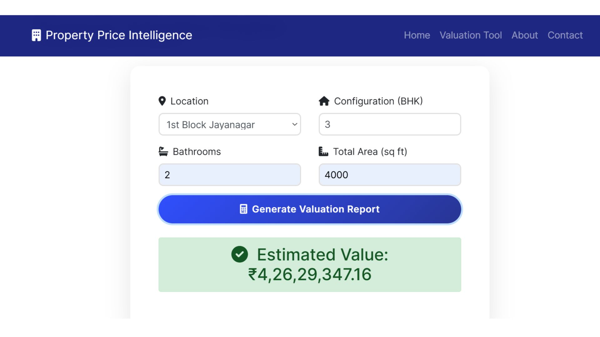

# 🏠 House Price Predictor

<div align="center">

[](https://www.python.org/)
[](https://flask.palletsprojects.com/)
[](https://scikit-learn.org/)
[](https://pandas.pydata.org/)

</div>

## Snapshoot's

<div>

   
  
   
  
</div>

## 📋 Overview

A sophisticated web application leveraging Flask and machine learning to predict house prices in Bangalore. Using Ridge Regression, it provides accurate price predictions based on location, BHK, bathrooms, and square footage.

### 🌐 Live Demo

[**Bangalore House Price Predictor**](https://bangalore-house-prediction-contribution.onrender.com/)

> ⚠️ **Note:** Initial loading may take a few minutes due to free-tier server constraints.

## ✨ Features

- 🎯 Interactive web interface for price prediction
- 📍 Comprehensive location selection
- 🏗️ Input fields for:
  - BHK (Bedrooms, Hall, Kitchen)
  - Number of bathrooms
  - Total square footage
- ⚡ Real-time price predictions

## 🛠️ Tech Stack

<details>
<summary><b>Backend Technologies</b></summary>

- 🐍 Flask (Python web framework)
- 🤖 Scikit-learn (Machine learning)
- 🐼 Pandas (Data manipulation)
- 📊 NumPy (Numerical computations)
</details>

<details>
<summary><b>Frontend Technologies</b></summary>

- 📄 HTML
- 🎨 CSS
- 🎭 Jinja2 (Template engine)
</details>

<details>
<summary><b>Machine Learning</b></summary>

- 📈 Ridge Regression model
- ⚙️ Feature engineering
- 🔄 Data preprocessing
</details>

## 📥 Installation

### Method 1: Using requirements.txt

```bash
# Clone the repository
git clone https://github.com/Akbarhusain12/Bangalore_house_prediction.git

# Navigate to project directory
cd Bangalore_house_prediction_contribution

# Install dependencies
pip install -r requirements.txt
```

### Method 2: Manual Installation

```bash
pip install Flask==2.0.2
pip install Werkzeug==2.0.3
pip install pandas==2.0.3
pip install numpy==1.25.2
pip install scikit-learn==1.5.2
pip install gunicorn==20.1.0
```

## 🚀 Running the Application

1. Start the Flask application:

```bash
python main.py
```

2. Access the application:

```
http://127.0.0.1:5001
```

## 📁 Project Structure

### 📌 Key Files

- `ridgemodel.pkl`: Trained Ridge Regression model
- `Bangalore House Prediction.ipynb`: Jupyter notebook containing:
  - 🔍 Data preprocessing steps
  - 🎯 Model training process
  - ⚙️ Feature engineering
  - 📊 Model evaluation

> 💡 **Tip:** Open the notebook in Google Colab or Jupyter Notebook

### 📂 Directory Structure

```
house-price-predictor/
├── 🐍 main.py              # Flask application
├── 🤖 ridgemodel.pkl      # Trained model
├── 📝 requirements.txt    # Dependencies
├── 📁 templates/          # HTML templates
├── 🎨 static/            # CSS and static files
└── 📓 .ipynb_checkpoints/
    └── Bangalore House Prediction-checkpoint.ipynb
```

## 🧮 Model Information

The price prediction engine uses a Ridge Regression model trained on Bangalore housing data. It considers:

- 📍 Location (with locality-based price variations)
- 📐 Property size (square footage)
- 🛏️ Number of bedrooms (BHK)
- 🚿 Number of bathrooms

The model is serialized in `ridgemodel.pkl` and loaded by Flask for real-time predictions.

## 🤝 Contributing

We welcome contributions! Feel free to:

- 🐛 Report bugs
- 💡 Suggest features
- 🔀 Submit pull requests

---

<div align="center">
Made with ❤️ for Bangalore house hunters
</div>
